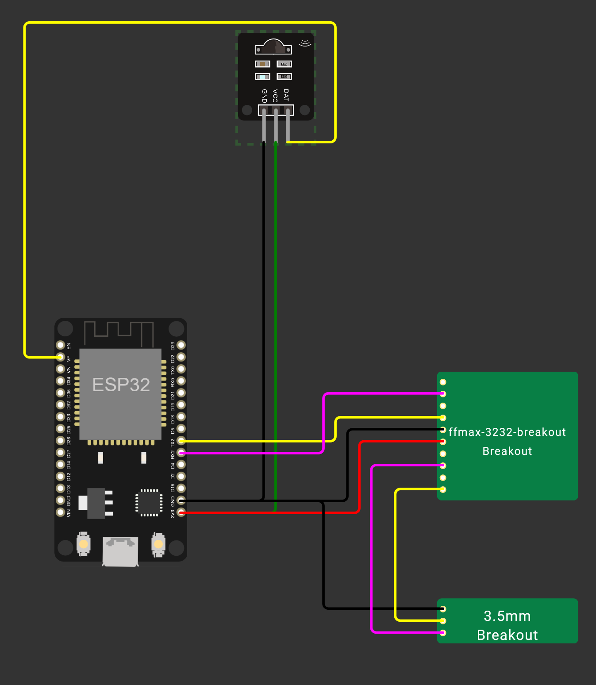
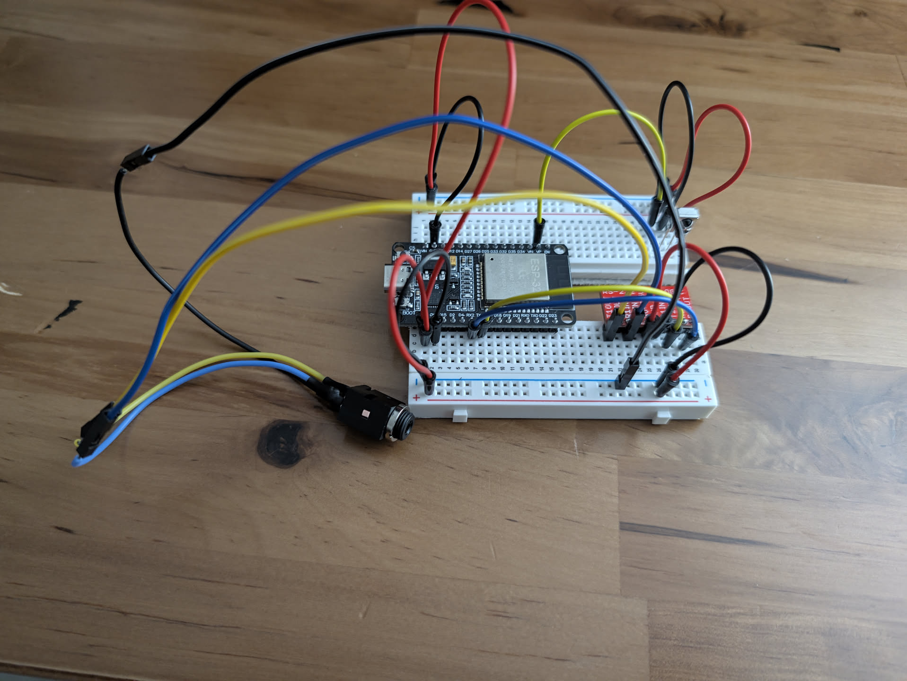
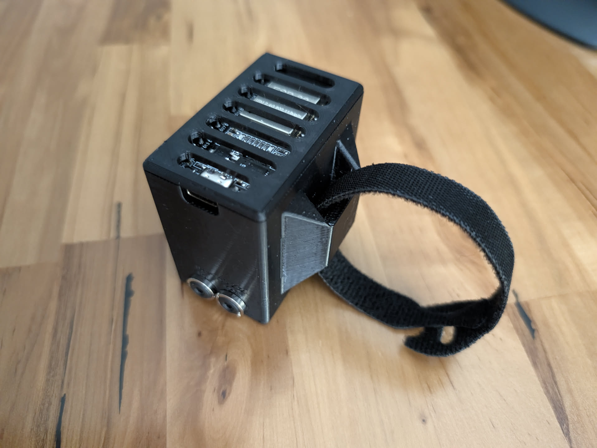

# esp32-ir-to-rs232
Convert Infrared to RS-232 using an ESP32. I did this for a Sony TV but the code should be easy to change for your device).

# Description
Simple ESP32 project to translate infrared remote commands into RS-232 for a Sony TV. For whatever reason no one on the internet can get the Sony TV "IR in" port to work with anything except other Sony equipment. I needed a universal remote hub to be able to control my TV without a dingleberry IR blaster emitter in front of the TV, I wanted it completely sleek and hidden behind the TV. So this project was born.

# Parts List
- ESP32 board (I used a ESP-WROOM-32 v1 USB-C but you can use whatever ESP32 you have [lying around](https://www.digikey.com/en/products/detail/espressif-systems/ESP32-DEVKITC-32UE/12091813))
  - If you use a different board than I did then adjsut the wiring diagram and code as needed (the code uses specific pins)
- [MAX3232 breakout board](https://www.digikey.com/en/products/detail/sparkfun-electronics/11189/5673779)
- [2x 3.5mm jacks](https://www.digikey.com/en/products/detail/same-sky-formerly-cui-devices/SJ3-35053A/24627983) (assuming your TV uses a 3.5mm Stereo jack, if not you only need 1 of these)
- IR Receiver (I used a [Sivago VS1838B](https://www.sivago.com.cn/upload/pdf/2022/VS1838B.pdf) [from Amazon](https://www.amazon.com/dp/B06XYNDRGF) but [here is one on Digikey](https://www.digikey.com/en/products/detail/vishay-semiconductor-opto-division/TSOP38238/1681362))
- [IR Blaster Emitter](https://www.amazon.com/Mlxkell-Infrared-Emitter-Extension-Emission/dp/B0C46Q4555) (I used a spare emitter from my IR repeater, these are simple 3.5mm mono jack to IR LED)
   - I used an emitter+receiver rather than raw voltage in from the IR emitter because there is no existing library for that translation (that I could find) and I did not want to spend that much time writing one when I could throw $5 in parts at the problem.
- USB power supply for the ESP32
- two 3.5mm male to male cables, one of them MUST be stereo (3 conductors)
  - One will go from your IR blaster to this project box
  - One will go from this project box to your TV's RS-232 in port
  - If your TV is not a Sony it may use a different cable than 3.5mm stereo, in that case get the right cable and jack for your situation
 
# Wiring Diagram
Not in these diagrams is the IR emitter. For the emitter I cut the cable off, soldered on a female jack, and electrical taped the emitter to the IR receiver. It's ugly but it will be inside a box and it saved me a ton of time.
Here is a [Wokwi diagram](https://wokwi.com/projects/469220279751726081)

- ESP32 Ground (GND) : IR Receiver Ground
- ESP32 Ground (GND) : MAX3232 GND
- ESP32 Ground (GND) : 3.5mm jack for RS-232 base/sleeve
- ESP32 3.3v (3V3) : IR Receiver VCC
- ESP32 3.3v (3V3) : MAX3232 3V-5.5V
- ESP32 pin GPIO36 (VP) : IR Receiver Data
- ESP32 pin GPIO17 (TX2) : MAX3232 TTL T1IN
- ESP32 pin GPIO16 (RX2) : MAX3232 TTL R1OUT
- MAX3232 RS-232 T1OUT : 3.5mm jack for RS-232 ring
- MAX3232 RS-232 R1IN : 3.5mm jack for RS-232 tip
- If you use an IR emitter like I did you can just leave the long cable coming out of your project box or you can switch it to a cleaner jack like I did
  - Cut the cable off the IR emitter, leaving some cable to work with and solder to your 3.5mm jack
  - Use your multimeter and figure out which of the 2 cables inside is the tip and which is the base/sleeve, then wire up the jack

# Programming
I used the Arduino IDE for this and when working with the breadboard I set up logging via serial 1 so the IDE can report back what is happening. This is good for verifying you set the TV to "enable standby" so it accepts RS-232 when off (maybe this is a Sony specific thing). The code I have is VERY Sony specific but can be easily edited for other TVs that accept RS-232.

# Important for Sony TVs
You have to enable standby mode for RS-232 to be able to power the TV on and you have to turn on RS-232 in the TV's settings. Differet TV models have the setting in different places so check your manual.
1. Enable RS-232 control
2. TV is on
3. ESP32 is all wired up and on
4. Cover up the IR Receiver on your TV
5. Press the 'Input' button on your remote that is connected to your ESP32, this enables "standby mode"
6. All remote commands should work, try using the menu and turning the TV both off and back on

# 3D Printed Box
All the deails and files for the project box are [over on Printables](https://www.printables.com/model/1778046-esp-wroom-32-case-with-source-files). But I made it so you can velcro the project box to your TV stand or edit the design as you see fit.

# Final Result

